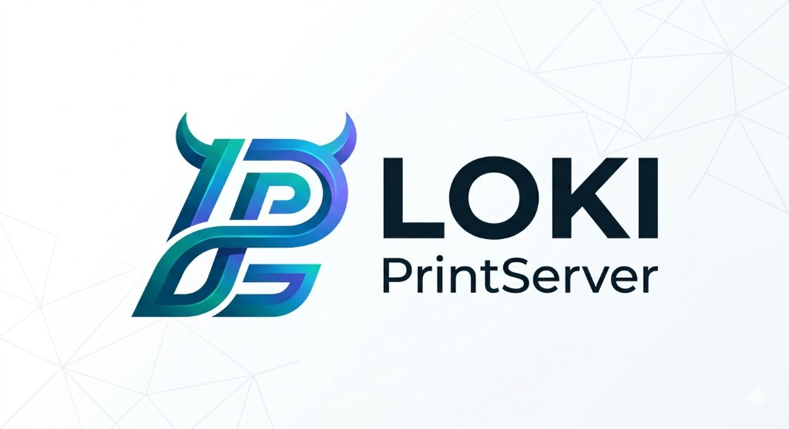

<p align="center">
  
</p>

<p align="center">
  <strong>Share USB devices (plotters, printers, scanners) over your network</strong><br>
  <sub>by BangerTECH</sub>
</p>

<p align="center">
  
  
  
  
</p>

---

## What is Loki-PrintServer?

Loki-PrintServer lets you plug a USB device (cutting plotter, printer, scanner, label printer…) into a **Raspberry Pi** and use it from **any computer on your network** — as if it were plugged in locally.

Works with **Illustrator + xfcut**, Silhouette Studio, Inkcut, and any other software that talks to a USB device.

---

## Server — Raspberry Pi Setup

> **Requires:** Raspberry Pi with Docker installed

```bash
git clone https://github.com/BangerTech/Loki-PrintServer.git
cd Loki-PrintServer/server
docker compose up -d
```

That's it. The server is now running.

**Web Dashboard:** open `http://<raspberry-pi-ip>:7576` in your browser.

---

## Client — Download & Install

Download the latest client for your platform from **[GitHub Releases](https://github.com/BangerTech/Loki-PrintServer/releases/latest)**:

| Platform | File | Installation |
|----------|------|--------------|
| **macOS (Apple Silicon + Intel)** | `Loki-Client.dmg` | Open → drag to Applications |
| **Windows** | `LokiClient.exe` | Run installer |
| **Linux** | `Loki-Client-linux` | `chmod +x` + run |

### First Launch

1. Open **Loki-Client** — it appears in your **menu bar** (macOS) or **system tray** (Windows/Linux)
2. The server on your network is found automatically
3. Click your server → select your device → **Attach**
4. The device appears locally — open your software and use it normally

> **macOS only:** On first launch right-click → Open (once, because the app is not notarized yet). If you get "App is damaged", run `xattr -cr /Applications/Loki-Client.app`

---

## How it works

```
┌─────────────────────────┐        ┌──────────────────────────┐
│   Raspberry Pi (Server) │        │  Your Computer (Client)  │
│                         │        │                          │
│  USB Plotter            │        │  Loki-Client             │
│    └─► usbipd  :7575   │◄──TCP──►│    └─► usbip attach      │
│        FastAPI :7576    │        │         /dev/ttyUSB0     │
│        CUPS    :631     │        │         or COM3          │
│        socat   :7580+   │        │  (device appears local!) │
└─────────────────────────┘        └──────────────────────────┘
```

| Device type | Forwarding method | Works on |
|---|---|---|
| Plotter / USB-Serial (CH340, FTDI) | Serial over TCP (socat) | macOS, Windows, Linux |
| USB Printer | CUPS / IPP network printer | macOS, Windows, Linux |
| Any USB device | USB/IP kernel passthrough | Windows (usbip-win), Linux |

---

## Supported devices

- ✂ Cutting plotters: Silhouette Cameo, Cricut, Graphtec, Roland, generic CH340
- 🖨 Printers: HP, Canon, Epson, Brother, Samsung
- 🏷 Label printers: DYMO LabelWriter, Brother QL
- 📷 Scanners: Epson Perfection, Canon CanoScan, HP ScanJet
- 🔌 Any other USB device (via USB/IP on Windows & Linux)

---

## Requirements

**Server:**
- Raspberry Pi (any model) running Raspberry Pi OS or any Debian-based Linux
- Docker

**Client:**
- macOS 11+, Windows 10+, or Linux
- macOS cutting plotters: **AMFI must be disabled** for virtual USB device support (see below)
- Windows: [usbip-win2 / USBip](https://github.com/vadimgrn/usbip-win2) for full USB passthrough (bundled)

---

## macOS — Virtual USB for Cutting Plotters

On macOS, Loki creates a **real virtual USB device** (`/dev/cu.usbmodem*`) that cutting software like **FineCut**, **xfcut**, and **Inkcut** recognizes natively. The virtual device mimics the original USB identity (Vendor ID, Product ID) so vendor-specific software detects it automatically.

**This requires AMFI (Apple Mobile File Integrity) to be disabled:**

| Setup | How to disable AMFI |
|-------|---------------------|
| **OpenCore / Hackintosh** | Add `amfi_get_out_of_my_way=1` to `boot-args` in your OpenCore `config.plist`, then reboot |
| **OpenCore Legacy Patcher** | Settings → Kernel Security → Enable "Disable AMFI" → Apply → Reboot |
| **Stock Mac** | Boot into Recovery → Terminal → `nvram boot-args="amfi_get_out_of_my_way=1"` → Reboot |

> Without AMFI disabled, Loki falls back to a PTY bridge (`/tmp/tty.loki-*`) which works for software that allows manual port entry, but won't be detected by IOKit-based programs like FineCut.

After first download, you may need to run:
```bash
xattr -cr /Applications/Loki-Client.app
```

---

## Build clients from source

```bash
git clone https://github.com/BangerTech/Loki-PrintServer.git
cd Loki-PrintServer

# macOS
bash client/build/build_mac.sh

# Windows (run on Windows)
client\build\build_windows.bat
```

---

## License

MIT License — © BangerTECH

